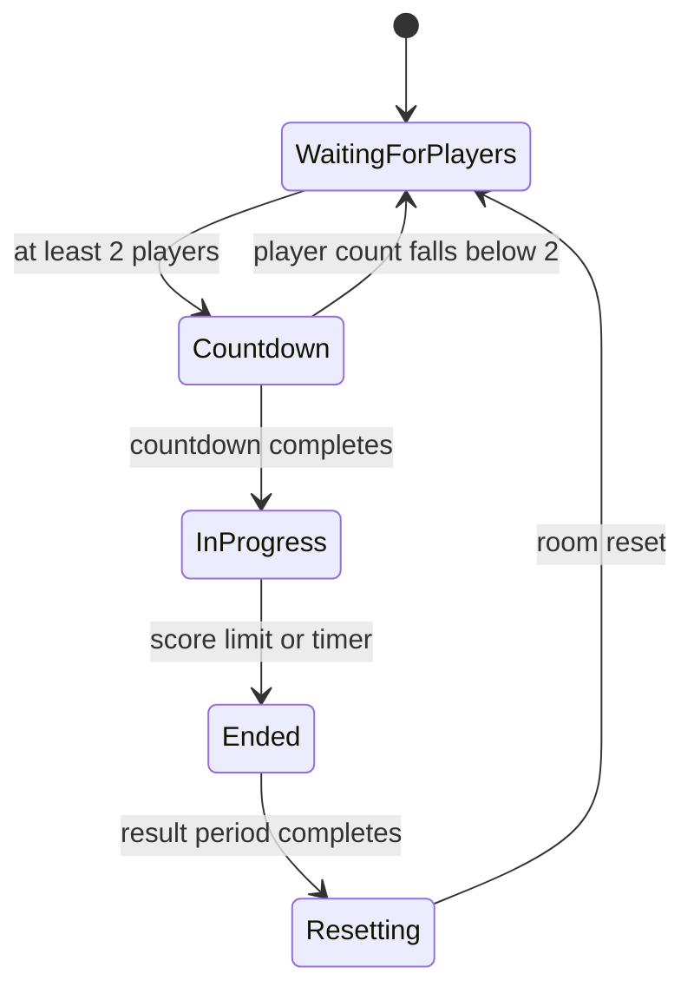
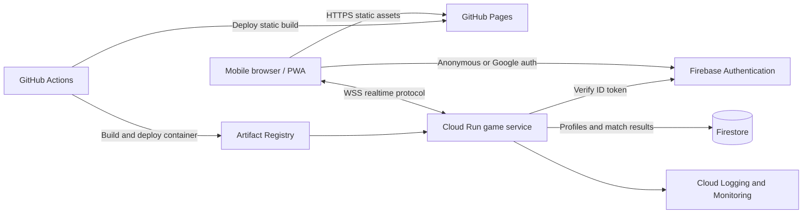

# scooter-shooter: Game Design Document

| Field                      | Value                                 |
| -------------------------- | ------------------------------------- |
| Status                     | Approved direction; pre-production    |
| Version                    | 0.1                                   |
| Last updated               | 2026-09-19                            |
| Primary platform           | Mobile web and installable PWA        |
| Client technology          | Babylon.js, TypeScript, Vite          |
| Static hosting             | GitHub Pages                          |
| Backend                    | Google Cloud Run, Node.js, TypeScript |
| Initial region             | Central Europe                        |
| Initial multiplayer target | 4 concurrent players per match        |
| Scale target               | 20 concurrent players per match       |
| Initial mode               | Team Deathmatch                       |

## 1. Executive summary

**scooter-shooter** is a colorful, low-poly, third-person online shooter built
for mobile browsers. Players join a short Team Deathmatch, move with a blue
virtual joystick, aim with a red virtual joystick, and automatically fire a
pistol while aiming. The first release prioritizes a stable four-player match
over breadth. The architecture must be measured and load-tested before the
player cap is raised to 20.

The client is a static Babylon.js application hosted on GitHub Pages. It is also
an installable Progressive Web App (PWA). A server-authoritative TypeScript game
service runs on Google Cloud Run and owns movement, shots, damage, respawns,
teams, score, and match timing. Firebase Authentication provides anonymous guest
identities that can later be linked to Google accounts. Firestore stores player
progression and completed match summaries.

The development budget is **EUR 0-10 per month**, with budget notifications
before total spend exceeds EUR 20. This is a target, not a guaranteed cap:
Google Cloud budget alerts do not stop services or prevent charges. The initial
Cloud Run service therefore scales to zero, has a deliberately low maximum
instance count, and uses explicit usage and concurrency limits.

## 2. Product vision

Create a responsive multiplayer game that can be opened from a link, installed
without an app store, and understood within one match.

### 2.1 Product pillars

1. **Playable in seconds.** Guest players can enter Quick Play without creating
   an account.
2. **Mobile clarity.** Controls, camera, combat feedback, and UI remain readable
   on a phone without requiring precise finger placement.
3. **Server-owned fairness.** The server decides movement validity, hits,
   health, scores, and match outcomes.
4. **Small, reliable releases.** Every milestone produces a deployable build.
5. **Affordable while small.** Idle infrastructure scales to zero and persistent
   storage is used only for durable player and match data.
6. **Original identity.** Visuals use original low-poly work and assets with
   verified permissive licenses, not copies of protected characters or games.

### 2.2 Success criteria for the first public test

- A first-time player can open the GitHub Pages URL, enter Quick Play, and move
  within 30 seconds on a typical 4G/Wi-Fi connection.
- Four players can complete three consecutive matches without a server restart,
  unrecoverable desynchronization, or a client crash.
- A disconnect does not end the match for remaining players.
- Hits, health, eliminations, team score, and winner are server-authoritative.
- The production client installs as a PWA and can reach the secure `wss://`
  Cloud Run endpoint.
- The client maintains 30 FPS on the defined minimum test device and targets 60
  FPS on the reference device.
- Monthly cost alerts and service limits are active before any public test.

### 2.3 Non-goals for the first public test

- Native iOS or Android packages
- More than one map, weapon, or game mode
- User-generated content
- AI-generated costumes
- Voice or text chat
- Ranked matchmaking
- Parties, clans, trading, shops, or payments
- Full gameplay in portrait orientation
- Guaranteed 20-player production capacity before load testing

## 3. Audience, platform, and accessibility

### 3.1 Audience

The initial audience is casual players in Central Europe who want short,
accessible multiplayer sessions. The design avoids graphic violence: defeated
characters use a stylized dissolve or respawn effect and do not show blood or
gore.

### 3.2 Supported presentation

- **Gameplay:** landscape orientation
- **Menus:** landscape or portrait
- **Input:** dual-stick multi-touch plus full keyboard and mouse gameplay
- **Distribution:** normal browser session and installable PWA
- **Initial browsers:** current and previous major versions of Chrome for
  Android and Safari for iOS

An orientation interstitial asks portrait users to rotate before entering a
match. Rotating during a match pauses local input, recomputes safe areas, and
returns to play after the landscape layout is stable. It does not pause the
server simulation.

### 3.3 Minimum device target

The minimum target is a WebGL 2-capable phone with 4 GB RAM released within the
last five years. The exact device matrix must be fixed during the vertical slice
using real hardware. Unsupported browsers receive a clear compatibility screen
rather than a broken scene.

### 3.4 Accessibility baseline

- UI respects safe areas, browser chrome, and large text settings where
  practical.
- Team identity uses color plus icons and labels; color is never the only cue.
- Separate sliders control music, effects, and aim sensitivity.
- Haptics, camera shake, and aim assist can be disabled.
- Reduced-effects mode removes expensive particles and strong screen motion.
- Buttons have a minimum 44 CSS-pixel touch target.

## 4. Core experience

### 4.1 Core loop

1. Open the game.
2. Continue as a guest or link/sign in with Google.
3. Select **Quick Play**.
4. Join an open match, including a match already in progress.
5. Move, find opponents, aim, and fire.
6. Earn team points through eliminations.
7. Respawn after defeat.
8. View the result and earned XP/Power Points.
9. Replay or return to the menu.

### 4.2 Session shape

| Setting          | Initial value | Notes                                       |
| ---------------- | ------------: | ------------------------------------------- |
| Teams            |             2 | Blue and Red                                |
| Initial capacity |             4 | Two players per team when full              |
| Future capacity  |            20 | Requires successful load test               |
| Match duration   |     4 minutes | Server-controlled, configurable             |
| Score limit      |            20 | First reached wins immediately              |
| Respawn delay    |     3 seconds | Configurable                                |
| Join in progress |           Yes | Player receives current authoritative state |
| Friendly fire    |            No | Teammates may still block movement          |
| Overtime         |            No | Higher score wins; equal score is a draw    |

If only one player is present, the room remains in a waiting state. The initial
release requires two players to start. A 10-second countdown begins when both
teams have at least one player. Team assignment minimizes team-size imbalance.

### 4.3 Match state machine



Late joiners spawn at their team's next valid spawn point and receive the
current timer, score, player states, and match sequence number.

## 5. Controls and camera

### 5.1 Movement joystick

The blue joystick occupies the lower-left thumb zone.

- Radial analog input controls forward/backward and strafe movement.
- A configurable dead zone prevents drift.
- Dragging outside the visual ring preserves input but clamps magnitude.
- Releasing the touch returns the stick to center and sends zero movement.
- The player moves relative to the camera's horizontal forward direction.

### 5.2 Aim and fire joystick

The red joystick occupies the lower-right thumb zone.

- The stick direction sets the player's world-space facing direction relative to
  the fixed camera.
- Crossing the fire threshold starts automatic pistol fire.
- Returning inside the threshold stops fire without resetting the last aim
  direction.
- The client sends aim and fire intent; it never declares a hit.

The control must track the touch identifier that began on it so additional
touches do not steal movement or aiming.

### 5.3 Desktop controls

- WASD or arrow keys move relative to the fixed camera.
- The mouse aims on the arena's horizontal plane. The aim direction is
  recalculated every frame from the cursor's position on the canvas, so the aim
  keeps revolving around the player while the player moves.
- Holding the left mouse button fires.
- `E` enters a nearby vehicle or exits the active vehicle. Vehicles steer
  smoothly toward the input direction rather than snapping.

### 5.4 Combat readability

Every attack must be visible from the fixed top-down camera:

- Bots carry a visible weapon and each shot renders a coloured tracer beam, a
  muzzle flash at the barrel, and an impact marker on the target.
- The player's weapon is scaled to the character model and uses the same
  muzzle-flash and tracer language in the player's accent colour.

### 5.5 Aim assistance

Aim assistance is intentionally mild:

- Only targets within a narrow screen-space cone and unobstructed line of sight
  are candidates.
- Assistance slows aim near a target rather than snapping to it.
- It does not alter server hit geometry.
- Strength is configurable and can be disabled.

### 5.6 Camera

- Fixed elevated top-down perspective that follows the controlled player
- No player-controlled orbit or zoom, keeping movement directions stable
- 3D models, lighting, occlusion, and depth remain visible
- Small, optional recoil kick
- No camera control by remote player state

## 6. Combat

### 6.1 Initial pistol

The first pistol is a server-validated hitscan weapon. Exact balance values are
configuration, not hard-coded behavior.

| Property            |         Initial tuning value |
| ------------------- | ---------------------------: |
| Damage              |                        25 HP |
| Health              |                       100 HP |
| Magazine            |                     8 rounds |
| Fire interval       |                       350 ms |
| Reload duration     |                        1.5 s |
| Maximum range       |                         35 m |
| Headshot multiplier | Disabled for initial release |

Four body hits eliminate a full-health opponent. Automatic fire continues while
the aim joystick exceeds its threshold, subject to fire rate, ammo, reload, and
match state.

### 6.2 Shot flow

1. Client samples aim and sends a fire intent with input sequence and local shot
   time.
2. Server checks player state, cadence, ammo, reload, time bounds, and aim
   plausibility.
3. Server rewinds eligible target hitboxes within a capped history window.
4. Server raycasts from the validated weapon/camera origin.
5. Server applies damage and emits a shot result.
6. Clients play tracer, muzzle, impact, hit marker, health, and elimination
   presentation from authoritative events.

The client may immediately show muzzle flash and recoil to hide latency, but it
only shows a confirmed hit marker after server confirmation.

### 6.3 Latency compensation

The server stores a short ring buffer of player transforms for rewind. Rewind is
capped to prevent clients from claiming arbitrarily old shots. The initial cap
is 200 ms and must be tuned from production latency data. World geometry is
static and does not need historical rewind in the MVP.

### 6.4 Reload

Reload begins automatically when firing with an empty magazine. A future manual
reload button may be added after touch testing. Elimination cancels reload.
Respawn restores a full magazine.

### 6.5 Health, elimination, and respawn

- Players start with 100 HP.
- Health cannot exceed its configured maximum or fall below zero.
- Damage from teammates is rejected.
- An elimination credits the last valid opposing attacker.
- The victim becomes non-colliding and cannot move or fire.
- The server selects a spawn, waits three seconds, restores state, and sends the
  respawn event.
- A short spawn-protection window prevents immediate damage but ends when the
  player fires.

### 6.6 Offline training rounds

Offline training runs as a best-of-five round match (first side to three round
wins) rather than a continuous free-for-all. This removes the spawn-camping
failure mode where eliminated players respawn into waiting opponents.

| Property         | Initial tuning value |
| ---------------- | -------------------: |
| Rounds to win    |                    3 |
| Round duration   |                 90 s |
| Warmup per round |                  4 s |
| Intermission     |                  5 s |
| Result screen    |                 10 s |

Round flow:

1. **Warmup** — every combatant is teleported to its spawn at full health and
   bots hold fire. No damage can be dealt.
2. **In progress** — the round is live.
3. **Round ended** — the round is awarded when one side is wiped out, or scored
   as a draw if the round timer expires.
4. **Intermission** — a short break, then the next round warmup.

There are no mid-round respawns. An eliminated combatant stays out until the
next round begins, so a losing side can never be farmed at its spawn point.

### 6.7 Bot fairness

Training bots are deliberately beatable and must never feel like aimbots.

| Property                  | Initial tuning value |
| ------------------------- | -------------------: |
| Engagement range          |                 11 m |
| Fully accurate range      |                  4 m |
| Accuracy at close range   |                  60% |
| Accuracy at maximum range |                  15% |
| Moving-target penalty     |        -20% absolute |
| Reaction time             |               500 ms |
| Shot interval             |               950 ms |
| Recovery between bursts   |                1.8 s |
| Damage per hit            |                 8 HP |

Rules:

- Bots cannot damage anything beyond their engagement range.
- Accuracy falls off linearly from the accurate range to the maximum range, and
  a moving player is harder to hit, so repositioning is rewarded.
- A bot must hold unobstructed line of sight for its full reaction time before
  its first shot. Breaking line of sight resets the timer.
- Bots fire in three-shot bursts and then recover, giving the player openings.
- Every shot is rendered, including misses, which visibly deflect past the
  player rather than silently disappearing.

## 7. Map and visual direction

### 7.1 First map: Blocktown

Blocktown is a compact low-poly city with:

- Two protected team spawn zones
- A central plaza that creates conflict
- Two flanking streets
- Short interior or covered routes
- Walls, parked props, planters, and low barriers for cover
- Two simple drivable vehicles support faster traversal in offline training.

The layout avoids long uninterrupted sight lines and dead ends. Spawn points
must not directly face enemy spawn points.

### 7.2 Spawn selection

The server scores candidate spawn points using:

- Distance from visible opponents
- Line of sight from opponents
- Nearby teammate presence
- Recent use
- Team ownership

If every spawn is unsafe, it chooses the highest-scoring point and applies spawn
protection.

### 7.3 Art direction

- Original, stylized, colorful low-poly forms
- Distinct silhouettes and team accents
- Baked lighting where practical
- One main directional light and limited dynamic lights
- Small texture atlases and compressed textures
- No copyrighted character, costume, map, logo, or audio imitation

Every third-party asset must have its source, author, license, modification
status, and attribution requirement recorded in an asset manifest.

### 7.4 Audio

The MVP includes pistol fire, reload, impact, elimination, respawn, countdown,
and result sounds. Audio begins only after user interaction to comply with
mobile browser autoplay rules. Positional audio is used in-match with aggressive
voice limits for performance.

## 8. User interface

### 8.1 Main menu

Initially active:

- **PLAY**
- **CHARACTER**
- **LEVEL**
- **POWER POINTS**
- **SETTINGS**

Vehicles are available in offline training. Multiplayer vehicle rules remain a
future feature until server-authoritative vehicle simulation is implemented.

### 8.1.1 Joining another player's game

Players meet through **room codes**, not a matchmaking queue. This keeps the
service at near-zero cost and lets two people play together on demand.

- **Host an online game** opens a room and shows a six-character code drawn from
  `ABCDEFGHJKLMNPQRSTUVWXYZ23456789`. The visually confusable characters `0`,
  `O`, `1`, and `I` are excluded so a code can be read aloud.
- **Copy invite link** copies the page URL with `?join=CODE` appended. Opening
  that link prefills the code so the guest only has to sign in and press Join.
- **Join** accepts a typed code. Unknown codes are rejected with
  `room_not_found` and the player stays in the menu.

Rooms live in memory on a single Cloud Run instance (`--max-instances=1`), so a
code always resolves to the process that owns it. Sharding rooms across
instances is tracked as a later capacity task.

### 8.2 Match HUD

- Top center: remaining time
- Top left/right: blue and red team scores with team symbols
- Bottom left: blue movement joystick
- Bottom right: red aim/fire joystick
- Bottom center: health and ammunition
- Center: small crosshair
- Temporary overlays: hit marker, elimination, reconnecting, orientation, and
  match result

### 8.3 Connection states

The client always presents an explicit state:

- Connecting
- Waiting for players
- Countdown
- In match
- Reconnecting
- Connection lost
- Backend unavailable
- Client update required

The game must not silently substitute local play when the backend is
unavailable.

## 9. Progression and identity

### 9.1 Authentication

Firebase Authentication supplies:

- Anonymous authentication for guest play
- Optional Google account linking
- Stable user ID for server authorization and persistence

Anonymous progress remains attached when the identity is linked correctly.
Signing in to a different existing account requires an explicit conflict
resolution flow; data must not be silently overwritten.

### 9.2 Levels

- Level range: 1-100
- Server stores level, current XP, and lifetime XP.
- XP thresholds are driven by versioned configuration.
- Match XP is awarded once from a unique completed match ID.

Initial XP sources:

| Event          |  XP |
| -------------- | --: |
| Complete match |  50 |
| Win            |  25 |
| Elimination    |   5 |

### 9.3 Power Points

Power Points are a non-purchasable play currency in the initial release.

| Event          | Power Points |
| -------------- | -----------: |
| Complete match |           10 |
| Win            |            5 |

The server owns balances and transaction history. A unique transaction ID makes
retries idempotent. Purchases and monetization are explicitly out of scope.

### 9.4 Character data

One character is available initially. The data model supports later additions:

```text
CharacterDefinition
- id
- displayName
- modelAssetId
- defaultSkinId
- enabled
- unlockRequirement
```

## 10. Technical architecture

### 10.1 System context



### 10.2 Repository layout

The implementation should use an npm workspace monorepo:

```text
/
  apps/
    client/                 Babylon.js PWA
    server/                 Cloud Run authoritative server
  packages/
    protocol/               Messages, schemas, codecs, version
    game-config/            Shared versioned tuning values
    simulation/             Deterministic/shared pure math where safe
  tests/
    load/                   Headless simulated clients
  docs/
    GDD.md
    operations/
  .github/
    workflows/
  package.json
```

Shared code must not leak server authority into the client. The client may share
message schemas and pure calculations, but the server remains the source of
truth.

### 10.3 Client modules

```text
Bootstrap
AssetLoader
SceneManager
InputRouter
MobileJoystick
PlayerPrediction
RemoteInterpolation
CameraController
WeaponPresentation
HUDController
AudioManager
NetworkClient
AuthClient
ProfileClient
PWAUpdateController
```

Babylon.js rendering is separated from network state. Network snapshots update a
presentation model; scene objects interpolate toward that model. This makes
reconnection, testing, and headless protocol tests possible without Babylon.js.

### 10.4 Server modules

```text
HttpServer
WebSocketGateway
AuthenticationMiddleware
ConnectionRegistry
Matchmaker
Room
FixedTickLoop
InputValidator
MovementSystem
LagCompensation
CombatSystem
HealthSystem
RespawnSystem
TeamDeathmatchMode
SnapshotPublisher
ProfileRepository
MatchResultRepository
Metrics
```

The room simulation runs at a fixed 20 Hz initially. Rendering frame rate and
server tick rate are independent.

### 10.5 Cloud Run topology

For the four-player test, the game service uses:

- Minimum instances: 0
- Maximum instances: 1
- One region in Central Europe
- WebSocket support over HTTPS
- One or more in-process rooms, bounded by measured CPU and memory
- Request timeout configured for long-lived connections

Limiting the service to one instance avoids routing players in one room to
different processes while the architecture is small. It also means the initial
deployment is not highly available and has finite capacity. That is an explicit
MVP tradeoff.

Before raising the maximum instance count, room placement needs a design that
guarantees all members of a room reach the owning process. Cloud Run session
affinity is best-effort and is not, by itself, sufficient as a game-room
ownership guarantee. Scale options must be evaluated from observed demand:

1. Keep one larger Cloud Run instance if it safely supports the target.
2. Add a lightweight room directory and instance-aware routing design.
3. Move dedicated room processes to a game-server platform only when demand
   justifies the additional baseline cost.

The 20-player target means 20 players in one tested room, not automatic support
for unlimited simultaneous matches.

## 11. Realtime protocol

### 11.1 Transport

- Secure WebSocket (`wss://`) for realtime traffic
- HTTPS endpoints for health, version, and non-realtime profile operations
- Binary messages after the prototype if measurements show JSON is a bottleneck
- Explicit protocol version in handshake

### 11.2 Connection handshake

1. Client obtains a Firebase ID token.
2. Client opens WebSocket and sends protocol version and token.
3. Server verifies token, origin, rate limits, and client version.
4. Server accepts Quick Play request.
5. Server returns room ID, player ID, team, tick, and initial snapshot.

Tokens must not appear in URLs or logs. Authentication is sent in the initial
application handshake because browser WebSocket APIs cannot set arbitrary
authorization headers.

### 11.3 Message groups

Client to server:

- `hello`
- `joinQuickPlay`
- `inputBatch`
- `fireIntent`
- `heartbeat`
- `leaveMatch`

Server to client:

- `welcome`
- `joinAccepted` / `joinRejected`
- `snapshot`
- `shotResult`
- `damage`
- `elimination`
- `respawn`
- `matchState`
- `protocolError`
- `serverShutdown`

Every message is schema-validated. Invalid or impossible input is rejected and
recorded; malformed traffic never reaches simulation logic.

### 11.4 Movement synchronization

- Client sends sequenced input, not authoritative transforms.
- Server simulates validated input at 20 Hz.
- Owning client predicts immediately and reconciles to acknowledged input.
- Remote players render from a short interpolation buffer.
- Teleports, respawns, and large corrections are explicit snapshot flags.
- Input rate, magnitude, sequence jumps, and timestamps are bounded.

### 11.5 Reconnection

The client retries transient disconnects with capped exponential backoff for up
to 15 seconds. The server keeps the player slot in a disconnected state during a
short grace period. Successful reconnection requires the same authenticated user
and reconnect token. Failure returns the player to the menu with a clear reason.

## 12. Data architecture

### 12.1 Firestore collections

```text
players/{uid}
  displayName
  level
  currentXp
  lifetimeXp
  powerPoints
  selectedCharacterId
  createdAt
  updatedAt
  schemaVersion

players/{uid}/transactions/{transactionId}
  type
  amount
  source
  matchId
  createdAt

matches/{matchId}
  mode
  startedAt
  endedAt
  winningTeam
  finalScore
  participantIds
  serverBuild
```

Realtime movement and active match state are never written to Firestore every
tick. They live in Cloud Run memory. Only durable summaries and progression are
persisted after a match.

### 12.2 Data rules

- The backend uses a service account and performs authoritative writes.
- Clients do not directly modify XP, level, currency, or match results.
- Match rewards are idempotent by `matchId` and player ID.
- Store the minimum personal data required.
- Define deletion and retention behavior before public account linking.

## 13. Security and abuse controls

- Allow only the production GitHub Pages origin in production CORS/origin
  checks; development origins are environment-specific.
- Verify Firebase ID tokens server-side.
- Validate every network message with size and rate limits.
- Apply per-connection input and fire-intent limits.
- Never trust client position, health, ammo, team, score, rewards, or hit
  claims.
- Keep secrets in Google Secret Manager or deployment configuration, never in
  the repository or static client.
- Treat Firebase web configuration as public identifiers, not secrets.
- Use least-privilege service accounts for runtime and deployment.
- Disable service-account keys; GitHub Actions authenticates with Workload
  Identity Federation.
- Pin GitHub Actions to maintained major versions initially and evaluate SHA
  pinning before public launch.
- Generate an SBOM/container provenance where supported and scan dependencies
  and container images in CI.

## 14. Performance budgets

Initial budgets are acceptance targets and must be measured on real devices.

| Area                                 |                       Budget |
| ------------------------------------ | ---------------------------: |
| Minimum gameplay frame rate          |                       30 FPS |
| Target gameplay frame rate           |                       60 FPS |
| Server simulation                    |                   20 ticks/s |
| Initial compressed application shell |                      <= 2 MB |
| Initial compressed gameplay download |                     <= 15 MB |
| Peak client memory                   |                    <= 350 MB |
| Mobile network snapshot traffic      | <= 50 KB/s per client target |
| Main-thread long task                |    No recurring task > 50 ms |
| Match join after cached shell        |        <= 10 s on typical 4G |

Optimization techniques include texture compression, mesh merging, thin
instances, object pooling, capped particles, spatial culling, limited shadow
casters, audio voice limits, and no per-frame garbage in hot paths.

## 15. PWA and GitHub Pages requirements

- Vite builds with the repository base path `/k-multiplayer-3d-game/`.
- The manifest includes name, icons, theme colors, landscape gameplay
  orientation, and standalone display mode.
- The service worker caches versioned static assets, not authenticated API or
  WebSocket responses.
- The application shell may open offline, but multiplayer clearly reports that a
  network connection is required.
- A new deployment must not leave the shell and chunks on incompatible versions.
  The update controller prompts for refresh outside an active match.
- GitHub Pages deploys only immutable build output from CI, never hand-edited
  generated files.

## 16. CI/CD design

### 16.1 Pull request checks

Every pull request runs:

1. Dependency install from lockfile
2. Formatting check
3. Lint
4. Type check for client, server, and shared packages
5. Unit tests
6. Protocol compatibility tests
7. Client production build
8. Server container build
9. Browser smoke test with a local server
10. Dependency and secret scanning

Pull requests do not deploy persistent preview infrastructure. The built client
artifact is retained for inspection.

### 16.2 Production deployment from `main`

Two path-aware jobs deploy independently:

**Client**

1. Build with the production Cloud Run URL and GitHub Pages base path.
2. Upload the Pages artifact.
3. Deploy through the protected `github-pages` environment.
4. Run a public URL smoke test.

**Server**

1. Authenticate to Google Cloud using GitHub OIDC and Workload Identity
   Federation.
2. Build the container with Cloud Build or GitHub Actions.
3. Push the immutable image to Artifact Registry.
4. Deploy a new Cloud Run revision with explicit CPU, memory, min/max instances,
   concurrency, timeout, region, runtime service account, and environment.
5. Verify `/livez` and `/version`.
6. Keep the previous revision available for rollback.

Database migrations, if introduced, run as an explicit backward-compatible job
before traffic moves. A client and server compatibility window prevents an old
cached PWA from immediately failing after deployment.

### 16.3 Workflow files planned

```text
.github/workflows/ci.yml
.github/workflows/deploy-pages.yml
.github/workflows/deploy-server.yml
.github/dependabot.yml
```

Production environments require branch protection on `main`, successful CI, and
GitHub environment approval if desired. Workflow permissions are declared
explicitly and default to read-only.

## 17. Initial Google Cloud and GitHub setup record

Infrastructure as code is intentionally deferred. The initial setup must be
performed once and its actual resource names, IDs, dates, and operators recorded
in `docs/operations/initial-cloud-setup.md` when implementation begins. No
credentials or secret values may be recorded.

### 17.1 Google Cloud resources

Create or select a dedicated Google Cloud project, then:

1. Attach billing and create a EUR 20 budget with notifications well before the
   threshold (for example 50%, 75%, 90%, and 100%).
2. Enable Cloud Run, Artifact Registry, Cloud Build, Firestore, Firebase
   Authentication, IAM Credentials, Security Token Service, Logging, Monitoring,
   and Secret Manager APIs as required.
3. Select one Central European Cloud Run region and create a Docker Artifact
   Registry repository in the same region.
4. Create Firestore in a compatible nearby location; the database location
   cannot be casually changed later.
5. Configure Firebase Authentication with anonymous and Google providers and
   authorize the GitHub Pages domain.
6. Create a least-privilege Cloud Run runtime service account.
7. Create a separate deployment service account.
8. Create a Workload Identity Pool and GitHub provider restricted to this exact
   repository and the intended branch/environment.
9. Grant the deployment identity only the roles required to push images, deploy
   Cloud Run, and act as the runtime service account.
10. Deploy Cloud Run with minimum instances `0` and maximum instances `1`.
11. Configure production origin allowlisting for the GitHub Pages URL.
12. Create uptime checks, error alerts, and log retention appropriate to the
    budget.

### 17.2 GitHub repository settings

1. Enable GitHub Pages with **GitHub Actions** as the source.
2. Create `production` and `github-pages` environments.
3. Add non-secret configuration variables such as project ID, region, service
   name, registry name, and public Firebase configuration.
4. Add the Workload Identity Provider and deployment service-account identifier
   as repository or environment configuration.
5. Do not add a downloaded Google service-account JSON key.
6. Protect `main` and require the CI workflow.
7. Restrict production deployment to `main`.

### 17.3 Setup record template

The later setup record must include:

```text
Setup date:
Google Cloud project ID:
Billing account attached: yes/no
Budget and alert thresholds:
Cloud Run region:
Cloud Run service:
Cloud Run public URL:
Artifact Registry repository:
Firestore location:
Firebase project/auth providers:
Runtime service account:
Deployment service account:
Workload Identity Pool/provider:
GitHub environments:
GitHub Pages URL:
Allowed production origins:
Cloud Run min/max instances:
Cloud Run CPU/memory/concurrency/timeout:
Monitoring alerts:
Operator:
Verification evidence:
```

## 18. Cost-control policy

The cost goal is achieved by architectural limits, not by assuming free tiers.

- Cloud Run minimum instances stays at zero until measured cold-start impact
  justifies a reviewed change.
- Maximum instances starts at one.
- Firestore receives match summaries and profiles, not simulation ticks.
- Cloud Logging excludes noisy successful per-tick and per-snapshot logs.
- Debug logging is disabled in production by default.
- Artifact retention removes old unreferenced images on a schedule.
- Egress-heavy assets are served by GitHub Pages, not Cloud Run.
- No Redis, load balancer, GKE cluster, managed SQL database, or always-on VM is
  included initially.
- Load tests use bounded duration and simulated-client limits.
- A monthly cost review records spend by SKU and compares it to concurrent
  player hours.

Budget alerts are informational. If a hard operational ceiling is required, an
explicit emergency runbook must disable public matchmaking or set Cloud Run
maximum instances to zero after human approval; automated billing shutdown can
corrupt active sessions and is not the default.

## 19. Observability and operations

### 19.1 Privacy-minimal telemetry

Collect:

- Service request count and errors
- Active connections and rooms
- Tick duration and missed ticks
- Snapshot size and send rate
- Authentication failures
- Match starts/completions/abandonments
- Reconnection success/failure
- Client crash/error reports without free-form personal content

Do not collect advertising identifiers, precise location, contacts, chat, or
cross-site behavior.

### 19.2 Health endpoints

- `/livez`: process is alive
- `/readyz`: service can accept new matches
- `/version`: build SHA, protocol version, and configuration version

Health endpoints reveal no credentials, player data, or internal stack traces.

### 19.3 Graceful shutdown

On Cloud Run termination:

1. Stop accepting new players.
2. Notify connected clients.
3. Finish or safely terminate active match persistence within the available
   shutdown window.
4. Close sockets with a reconnectable reason.

The first topology cannot promise match survival across instance termination.
That limitation must be visible in test reports and revisited before a larger
launch.

## 20. Testing strategy

### 20.1 Automated tests

- Pure simulation unit tests
- Movement validation and boundary tests
- Weapon cadence, ammo, reload, and range tests
- Damage, elimination, score, and respawn tests
- Match state-machine tests
- Protocol schema and backward-compatibility tests
- Authentication and authorization integration tests
- Firestore reward idempotency tests
- Client UI and PWA smoke tests
- Container health test
- Headless simulated-client load test

### 20.2 Required manual device tests

- Android Chrome and installed PWA
- iOS Safari and home-screen PWA
- Touch controls with two simultaneous thumbs
- Rotation, safe areas, browser interruption, and app background/foreground
- Wi-Fi to mobile-network transition
- High latency, jitter, packet delay, and reconnect
- Low-power/reduced-effects mode
- Audio unlock and mute behavior

### 20.3 Multiplayer acceptance gate

Before raising capacity from 4 toward 20:

- Run stepped tests at 4, 8, 12, 16, and 20 simulated clients.
- Record server CPU, memory, tick p50/p95/p99, outbound bandwidth, errors, and
  cost per player-hour.
- Complete a real-device match at each approved step.
- Reject a capacity increase if the server misses its tick budget, clients
  exceed traffic budgets, or reconciliation becomes visibly unstable.

## 21. Delivery milestones

### Milestone 0: Foundation

- Monorepo, shared protocol, lint/type/test/build
- Blank Babylon.js PWA on GitHub Pages
- Health-only Cloud Run service
- GitHub OIDC deployment
- Budget alerts and setup record

**Gate:** Both deployments are reproducible from `main`; no long-lived key is
stored in GitHub.

### Milestone 1: Offline movement vertical slice

- Blockout map
- Character, camera, touch movement, touch aiming
- Responsive landscape HUD
- Performance instrumentation

**Gate:** Stable minimum 30 FPS on the minimum test device.

### Milestone 2: Offline combat

- Pistol presentation
- Hit geometry, health, elimination, respawn
- Team Deathmatch rules in a local test harness

**Gate:** All combat and match-state tests pass.

### Milestone 3: Two-player authoritative multiplayer

- Authentication and WebSocket handshake
- Input prediction, server movement, reconciliation, interpolation
- Authoritative hitscan, health, respawn, score, and timer
- Disconnect and reconnect handling

**Gate:** Two real devices complete three matches.

### Milestone 4: Four-player public test

- Quick Play and join-in-progress
- Firestore profile and idempotent rewards
- Result screen and progression
- Monitoring, runbooks, and four-client load test

**Gate:** Public-test success criteria in section 2.2 are met.

### Milestone 5: Capacity validation

- Network and simulation profiling
- Progressive load tests to 20
- Architecture decision for multi-instance room ownership

**Gate:** The supported player cap equals the highest verified test result; it
is never advertised as 20 before evidence supports 20.

### Milestone 6 and later

- Additional characters and cosmetics
- One simple vehicle only after core matches are stable
- Additional game modes as isolated rule modules
- AI costume ideation as a separately deployable optional service

## 22. Future extensibility

### 22.1 Game modes

Each mode implements a narrow server-side interface:

```text
GameMode
- initialize(context)
- canDamage(attacker, target)
- onPlayerJoined(player)
- onPlayerEliminated(event)
- update(tick)
- getSpawnPolicy(player)
- getScore()
- getResult()
- dispose()
```

Team Deathmatch is the only production mode until its match lifecycle is stable.
Future modes must not add conditionals throughout core networking.

### 22.2 Weapons

Weapon definitions are versioned data. Weapon behavior composes server systems
for fire policy, targeting, damage, and ammo. Client weapon views consume the
same definition version for presentation but cannot override it.

### 22.3 AI costume designer

The future AI feature is an optional service behind a separate API and feature
flag. Failure or removal cannot block login, matchmaking, progression, or normal
costume selection. Generated concepts require policy checks, moderation, rate
limits, and an explicit cost budget before implementation.

## 23. Risks and mitigations

| Risk                                                          | Impact                     | Mitigation                                                                    |
| ------------------------------------------------------------- | -------------------------- | ----------------------------------------------------------------------------- |
| Mobile WebGL performance varies widely                        | Poor frame rate or crashes | Real-device gate, asset budgets, reduced-effects mode                         |
| Cloud Run cold start delays first match                       | Slow first connection      | Loading state, measure first; consider min instance only after cost review    |
| Long-lived WebSockets consume billable instance time          | Budget overrun             | Scale to zero, max one instance, usage alerts, bounded public test            |
| Multi-instance room routing is not solved by session affinity | Split or lost matches      | Keep max one initially; design room ownership before scaling                  |
| Browser backgrounding suspends client                         | Disconnect/desync          | Graceful reconnect and explicit background handling                           |
| GitHub Pages and cached PWA deploy out of sync with server    | Protocol failure           | Version handshake and compatibility window                                    |
| Server-authoritative movement feels delayed                   | Poor controls              | Client prediction, reconciliation, interpolation                              |
| Anonymous users lose access to local identity                 | Lost progress              | Encourage optional linking and explain guest limitations                      |
| Cost estimate changes with pricing/traffic                    | Unexpected bill            | Alerts, SKU review, hard service limits; verify current pricing before launch |

## 24. Definition of done

A feature is done only when:

- Its behavior and failure states match this document.
- Server authority boundaries are preserved.
- Automated tests cover core rules.
- Mobile touch behavior is tested on real hardware when relevant.
- Production build and deployment succeed through CI.
- Operational logging is useful but does not expose personal data or secrets.
- Documentation and configuration are updated.
- The game remains startable and the previous completed flow still works.

## 25. Decisions recorded

| Decision                  | Selected direction                                          |
| ------------------------- | ----------------------------------------------------------- |
| Client                    | Babylon.js + TypeScript                                     |
| Packaging                 | Installable PWA and normal mobile browser                   |
| Identity                  | Guest play plus optional Google sign-in                     |
| Initial geography         | Central Europe                                              |
| Cost target               | EUR 0-10/month; alerts before EUR 20                        |
| Multiplayer rollout       | 4 players first, then test toward 20                        |
| Authority                 | Server-authoritative movement, combat, health, and score    |
| Infrastructure management | Manual initial setup, documented for later reference        |
| Orientation               | Landscape gameplay; portrait-compatible menus               |
| Assets                    | Original low-poly and verified permissively licensed assets |
| Deployment                | PR checks; production deployment from `main`                |
| URLs                      | Default GitHub Pages and Cloud Run URLs                     |
| Telemetry                 | Privacy-minimal operations and error reporting              |
| Weapon simulation         | Server-validated hitscan with latency compensation          |
| Matchmaking               | Quick Play, open-room fill, join-in-progress                |

All numeric gameplay and infrastructure values are initial hypotheses. They must
live in configuration where practical and change only through measured testing,
not undocumented code edits.
